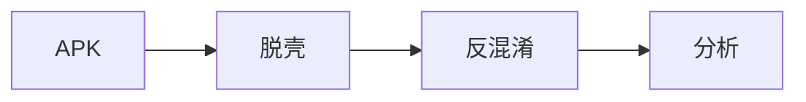

正文从这里开始，用 Markdown 写。第一段（到第一个空行为止）会被当作首页摘要。

## 一、插入图片

图片文件放到 `images/posts/<分类>/` 下，比如 `images/posts/android/unpack-1.png`，
然后在正文里用**从根目录开始的绝对路径**引用：


> 多张图建议按文章建子目录，例如 `images/posts/android/2026-shpssdk/xxx.png`，好管理。

## 二、插入视频

Markdown 本身不支持视频，三种做法任选：

**① B 站 / YouTube 嵌入（推荐，不占仓库、不耗流量）**

直接写 HTML，放 iframe：

<iframe src="//player.bilibili.com/player.html?bvid=BV1xx411x7xx&page=1"
        scrolling="no" border="0" frameborder="no" framespanborder="0"
        allowfullscreen="true" width="100%" height="480"></iframe>

YouTube 同理：`<iframe width="100%" height="480" src="https://www.youtube.com/embed/视频ID"></iframe>`

**② 仓库内自托管小视频（HTML5 video）**

把 mp4 放 `images/posts/<分类>/demo.mp4`（注意 GitHub 单文件 ≤100MB、仓库总量建议 <1GB、Pages 月流量软上限 100GB，大视频别走这条）：

<video src="/images/posts/android/demo.mp4" controls width="100%"></video>

**③ 动图 GIF**：当作普通图片插入即可：``

## 三、代码高亮

```javascript
const base = Module.findBaseAddress("libfoo.so");
Interceptor.attach(base.add(0x1234), {
  onEnter(args) { console.log("arg0 =", args[0]); },
});
```

## 四、流程图 / 时序图（需在 front matter 开 mermaid: true）


